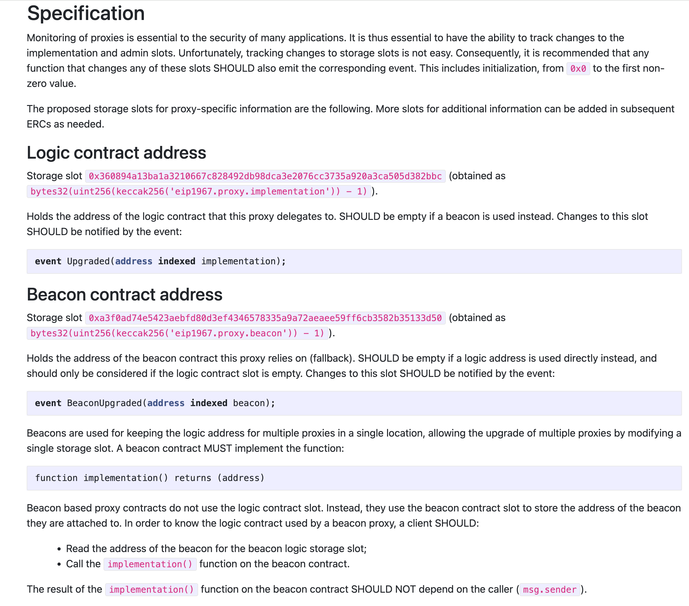
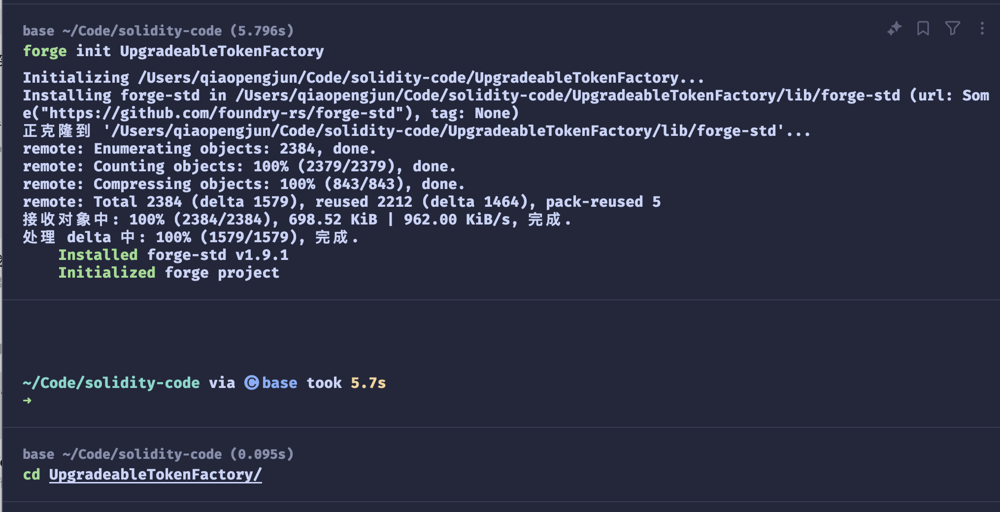
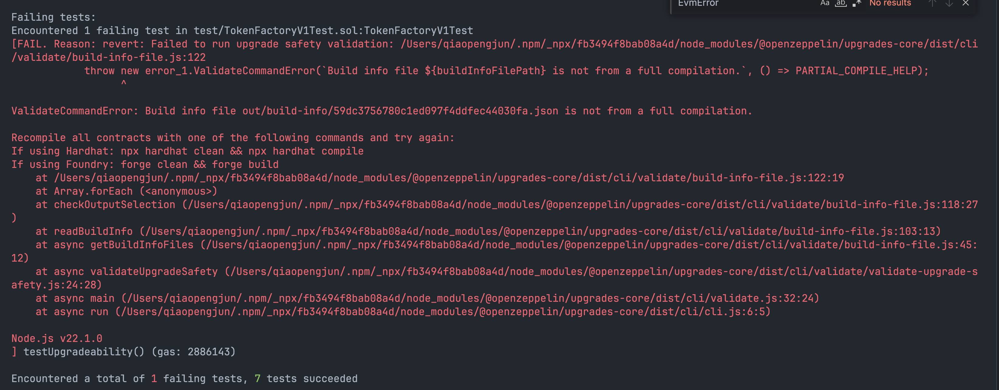
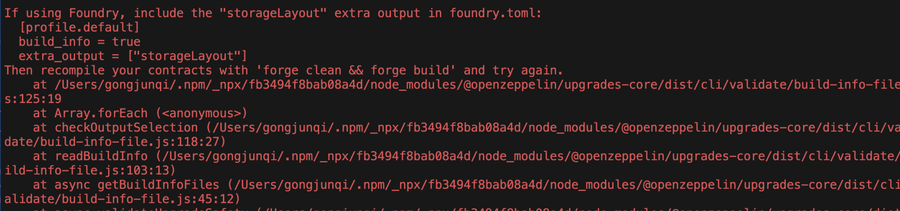
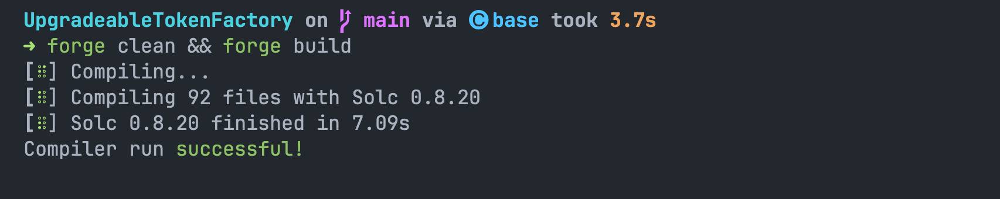
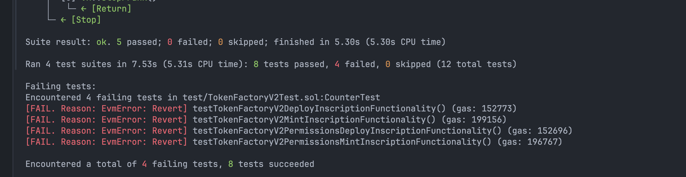

# 实战：使用Foundry 实现⼀个可升级的工厂合约 UpgradeableTokenFactory

## 实践可升级合约及最小代理

挑战以铸币工厂为例， 理解可升级合约的编写及最小代理如何节省 Gas 。

实现⼀个可升级的工厂合约，工厂合约有两个方法：

1. `deployInscription(string symbol, uint totalSupply, uint perMint)` ，该方法用来创建 ERC20 token，（模拟铭文的 deploy）， symbol 表示 Token 的名称，totalSupply 表示可发行的数量，perMint 用来控制每次发行的数量，用于控制`mintInscription`函数每次发行的数量
2. `mintInscription(address tokenAddr)` 用来发行 ERC20 token，每次调用一次，发行perMint指定的数量。

要求：
• 合约的第⼀版本用普通的 new 的方式发行 ERC20 token 。
• 第⼆版本，deployInscription 加入一个价格参数 price ` deployInscription(string symbol, uint totalSupply, uint perMint, uint price)` , price 表示发行每个 token 需要支付的费用，并且 第⼆版本使用最小代理的方式以更节约 gas 的方式来创建 ERC20 token，需要同时修改 mintInscription 的实现以便收取每次发行的费用。

## token 的创建和发行不需要任何中心化的管理者

#### 在某些区块链项目中，**token 的创建和发行不需要任何中心化的管理者**，这种设计背后体现了区块链技术的一些核心思想，包括去中心化、公平性和透明性。

### 解释：

1. **没有管理员**：
   - 在这种系统中，token 的创建和发行是通过智能合约自动执行的，没有一个中心化的实体（如传统金融中的银行或公司）来干预或管理这一过程。所有的操作都是由智能合约代码决定的，而智能合约的执行是去中心化的。

2. **公平发射**：
   - 公平发射（Fair Launch）指的是所有参与者在创建和发行 token 时，拥有平等的机会，没有任何人或组织可以通过特权获得额外的优势或机会。这种方式可以避免早期投资者或特权用户对 token 的不公平控制。

3. **铭文火的背后思想**：
   - 这种思想反映了区块链和去中心化技术的核心理念，即通过智能合约的自执行机制，去中心化地管理 token 的生命周期，从而减少对中心化控制的依赖，增加系统的透明度和公平性。

### 如何实现：

1. **智能合约**：
   - 使用智能合约自动化创建和发行 token 的流程。例如，发行 ERC20 token 或 ERC721 NFT，可以通过智能合约定义和执行这些操作。

2. **去中心化**：
   - 在没有中心化管理员的情况下，所有操作和决策都是由智能合约和区块链网络的共识机制决定的。所有的创建和发行过程都是透明的，所有参与者都可以在区块链上查看。

3. **公平性**：
   - 公平发射可能涉及设计机制确保所有用户能够以相同的条件获得 token。例如，不通过私募或预售，而是通过公开拍卖或其他公平的分发方式进行发行。

### 示例：

- **DeFi 代币**：很多去中心化金融（DeFi）项目的 token 发行采用了公平发射的方式，不依赖于传统的中心化机构，所有人可以通过参与特定的去中心化平台获得代币。
  
- **NFT 项目**：某些 NFT 项目也可能采用这种方式，在没有中心化管理者的情况下，通过智能合约进行公开的铸造（minting）和分发。

##### token 的创建和发行不需要管理员，这个是铭文火的背后思想，没有管理员，公平发射。

这句话强调了去中心化和公平发射在区块链和加密货币项目中的重要性，突出了技术对传统管理模式的挑战。

## 什么是虚函数

在 Solidity 中，虚函数（Virtual Function）指的是一种可以被子合约重写的方法。虚函数是一种合约的函数声明，它允许在派生合约中定义特定的实现，而不是在基合约中提供一个固定的实现。

### 虚函数的概念

- **虚函数**：在基合约中声明的函数，可以被派生合约重写以提供不同的实现。
- **覆盖**：派生合约中的实现会覆盖基合约中的实现。

### 如何使用虚函数

在 Solidity 中，你可以通过以下步骤定义和使用虚函数：

1. **定义虚函数**：
   在基合约中使用 `virtual` 关键字标记函数，表示该函数可以被子合约重写。

   ```solidity
   pragma solidity ^0.8.0;
   
   contract BaseContract {
       // 声明虚函数
       function getValue() public virtual pure returns (uint256) {
           return 1;
       }
   }
   ```

2. **重写虚函数**：
   在派生合约中使用 `override` 关键字实现虚函数的具体逻辑。

   ```solidity
   pragma solidity ^0.8.0;
   
   contract DerivedContract is BaseContract {
       // 重写虚函数
       function getValue() public override pure returns (uint256) {
           return 2;
       }
   }
   ```

### 示例解释

```solidity
pragma solidity ^0.8.0;

contract BaseContract {
    // 声明虚函数
    function getValue() public virtual pure returns (uint256) {
        return 1;
    }
}

contract DerivedContract is BaseContract {
    // 重写虚函数
    function getValue() public override pure returns (uint256) {
        return 2;
    }
}
```

在上面的代码中：

- `BaseContract` 中的 `getValue()` 函数被标记为 `virtual`，这意味着它可以在派生合约中被重写。
- `DerivedContract` 中重写了 `getValue()` 函数，使用 `override` 关键字表示这个函数重写了基合约中的 `getValue()` 函数。

### 虚函数的特点

- **多态性**：虚函数实现了面向对象编程中的多态性，使得你可以在不同的派生合约中提供不同的实现。
- **合约继承**：虚函数使得合约的继承机制更加灵活，可以通过继承链中的不同实现来实现复杂的逻辑。

### 注意事项

- **构造函数**：构造函数不能是虚函数。
- **访问控制**：虚函数和覆盖函数的访问控制修饰符必须一致，例如都为 `public` 或 `external`。
- **`override` 关键字**：派生合约中重写的函数必须使用 `override` 关键字标记。

虚函数是 Solidity 合约开发中实现灵活和可扩展设计的重要工具。

## 什么情况下会用到`delegatecall`?

- 代理合约（`Proxy Contract`）：将智能合约的存储合约和逻辑合约分开：代理合约（`Proxy Contract`）存储所有相关的变量，并且保存逻辑合约的地址；所有函数存在逻辑合约（`Logic Contract`）里，通过`delegatecall`执行。当升级时，只需要将代理合约指向新的逻辑合约即可。
- EIP-2535 Diamonds（钻石）：钻石是一个支持构建可在生产中扩展的模块化智能合约系统的标准。钻石是具有多个实施合约的代理合约。

### EIP-1967

https://eips.ethereum.org/EIPS/eip-1967



## 合约升级方式

- 透明代理（Transparent Proxy）- ERC1967Proxy
- UUPS（universal upgradeable proxy standard）- ERC-1822

### ERC-1822: Universal Upgradeable Proxy Standard (UUPS) 

# 

https://eips.ethereum.org/EIPS/eip-1822


## 使用 DelegateCall 要注意的点

- ##### 代理和逻辑合约的存储布局需要一致。

- ##### `delegateCall` 返回值

- ##### `(bool success, bytes memory returnData) = address.delegatecall(payload)`

- ##### `Bytes` 需转化为具体的类型

- ##### 不能有函数冲撞

- ##### 初始化问题？ - 实现合约中构造函数无效

### ERC-1167: Minimal Proxy Contract 

https://eips.ethereum.org/EIPS/eip-1167

https://github.com/optionality/clone-factory

## 创建项目



## 项目目录

```shell
├── script
│   ├── DeployProxy.s.sol
│   ├── ERC20Token.s.sol
│   ├── TokenFactoryV1.s.sol
│   └── TokenFactoryV2.s.sol
├── src
│   ├── ERC20Token.sol
│   ├── TokenFactoryV1.sol
│   └── TokenFactoryV2.sol
├── test
│   ├── ERC20TokenTest.sol
│   ├── TokenFactoryV1Test.sol
│   └── TokenFactoryV2Test.sol
```


## 代码

### `ERC20Token.sol` 文件

```solidity
```

### `TokenFactoryV1.sol` 文件

```solidity
```

### `TokenFactoryV2Test.sol` 文件

```solidity
```


## 测试代码

### `ERC20TokenTest.sol` 文件

```solidity
```

### `TokenFactoryV1Test.sol` 文件

```solidity
```

### `TokenFactoryV2Test.sol` 文件

```solidity
```


## 部署

第一步：部署 `ERC20Token`  合约

第二步：部署 `TokenFactoryV1`  合约

第三步：部署 `TokenFactoryV2`  合约

第四步： 部署 `DeployUUPSProxy`  代理合约

### 部署脚本

#### `ERC20Token.s.sol` 文件

```solidity
```

#### `TokenFactoryV1.s.sol` 文件

```solidity
```

#### `TokenFactoryV2.s.sol` 文件

```solidity
```


### 问题

#### 报错





#### 解决



问题二




### 测试输出

```shell
UpgradeableTokenFactory on  main [!?] via 🅒 base took 8.2s 
➜ forge test -vv            
[⠒] Compiling...
No files changed, compilation skipped

Ran 1 test for test/ERC20TokenTest.sol:ERC20TokenTest
[PASS] testERC20Functionality() (gas: 123304)
Logs:
  0x7c8999dC9a822c1f0Df42023113EDB4FDd543266

Suite result: ok. 1 passed; 0 failed; 0 skipped; finished in 1.67ms (61.00µs CPU time)

Ran 4 tests for test/TokenFactoryV2Test.sol:CounterTest
[PASS] testTokenFactoryV2DeployInscriptionFunctionality() (gas: 2903155)
Logs:
  0x7c8999dC9a822c1f0Df42023113EDB4FDd543266
  deployInscription  msg.sender, address: 0x7c8999dC9a822c1f0Df42023113EDB4FDd543266

[PASS] testTokenFactoryV2MintInscriptionFunctionality() (gas: 3002961)
Logs:
  0x7c8999dC9a822c1f0Df42023113EDB4FDd543266
  deployInscription  msg.sender, address: 0x7c8999dC9a822c1f0Df42023113EDB4FDd543266

[PASS] testTokenFactoryV2PermissionsDeployInscriptionFunctionality() (gas: 2905067)
Logs:
  0x7c8999dC9a822c1f0Df42023113EDB4FDd543266
  deployInscription  msg.sender, address: 0x6CA6d1e2D5347Bfab1d91e883F1915560e09129D

[PASS] testTokenFactoryV2PermissionsMintInscriptionFunctionality() (gas: 3000572)
Logs:
  0x7c8999dC9a822c1f0Df42023113EDB4FDd543266
  deployInscription  msg.sender, address: 0x6CA6d1e2D5347Bfab1d91e883F1915560e09129D

Suite result: ok. 4 passed; 0 failed; 0 skipped; finished in 2.23ms (1.95ms CPU time)

Ran 2 tests for test/Counter.t.sol:CounterTest
[PASS] testFuzz_SetNumber(uint256) (runs: 256, μ: 30977, ~: 31288)
[PASS] test_Increment() (gas: 31303)
Suite result: ok. 2 passed; 0 failed; 0 skipped; finished in 5.42ms (4.31ms CPU time)

Ran 5 tests for test/TokenFactoryV1Test.sol:TokenFactoryV1Test
[PASS] testTokenFactoryV1DeployInscriptionFunctionality() (gas: 2972857)
Logs:
  0x7c8999dC9a822c1f0Df42023113EDB4FDd543266
  deployInscription newToken:  0x8d2C17FAd02B7bb64139109c6533b7C2b9CADb81

[PASS] testTokenFactoryV1MintInscriptionFunctionality() (gas: 3068046)
Logs:
  0x7c8999dC9a822c1f0Df42023113EDB4FDd543266
  deployInscription newToken:  0x8d2C17FAd02B7bb64139109c6533b7C2b9CADb81

[PASS] testTokenFactoryV1PermissionsDeployInscriptionFunctionality() (gas: 2973252)
Logs:
  0x7c8999dC9a822c1f0Df42023113EDB4FDd543266
  deployInscription newToken:  0x8d2C17FAd02B7bb64139109c6533b7C2b9CADb81

[PASS] testTokenFactoryV1PermissionsMintInscriptionFunctionality() (gas: 3065556)
Logs:
  0x7c8999dC9a822c1f0Df42023113EDB4FDd543266
  deployInscription newToken:  0x8d2C17FAd02B7bb64139109c6533b7C2b9CADb81

[PASS] testUpgradeability() (gas: 6337394)
Logs:
  0x7c8999dC9a822c1f0Df42023113EDB4FDd543266

Suite result: ok. 5 passed; 0 failed; 0 skipped; finished in 6.02s (6.02s CPU time)

Ran 4 test suites in 6.02s (6.03s CPU time): 12 tests passed, 0 failed, 0 skipped (12 total tests)

UpgradeableTokenFactory on  main [!?] via 🅒 base took 6.7s 
```


## Foundry Upgrades

### Run these commands:

```shell
forge install foundry-rs/forge-std
forge install OpenZeppelin/openzeppelin-foundry-upgrades
forge install OpenZeppelin/openzeppelin-contracts-upgradeable
```

#### Set the following in `remappings.txt`, replacing any previous definitions of these remappings:

```shell
@openzeppelin/contracts/=lib/openzeppelin-contracts-upgradeable/lib/openzeppelin-contracts/contracts/
@openzeppelin/contracts-upgradeable/=lib/openzeppelin-contracts-upgradeable/contracts/
```

#### Configure your `foundry.toml` to enable ffi, ast, build info and storage layout:

```toml
[profile.default]
ffi = true
ast = true
build_info = true
extra_output = ["storageLayout"]
```


更多请参考：https://github.com/OpenZeppelin/openzeppelin-foundry-upgrades

## 源码


## 参考

- [ERC1967Utils](https://github.com/OpenZeppelin/openzeppelin-contracts/blob/master/contracts/proxy/ERC1967/ERC1967Utils.sol)
- [ERC1967Proxy](https://github.com/OpenZeppelin/openzeppelin-contracts/blob/master/contracts/proxy/ERC1967/ERC1967Proxy.sol)
- [Foundry Book](https://book.getfoundry.sh/)
- https://github.com/OpenZeppelin/openzeppelin-foundry-upgrades
- https://github.com/OpenZeppelin/openzeppelin-upgrades
- https://sepolia.etherscan.io/address/0x2b25e3f0879c4f9d7dedfe5414d6e48045b2fa57#writeProxyContract
- https://github.com/OpenZeppelin/openzeppelin-contracts
- https://eips.ethereum.org/EIPS/eip-1967
- https://eips.ethereum.org/EIPS/eip-1822
- https://eips.ethereum.org/EIPS/eip-1167
- https://github.com/optionality/clone-factory